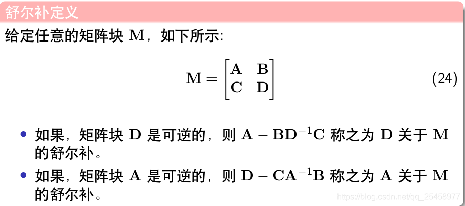
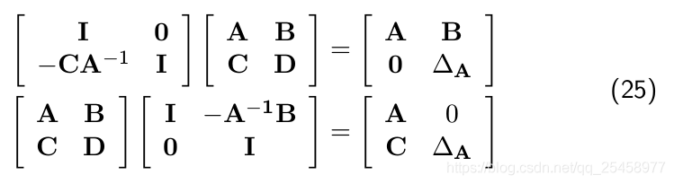
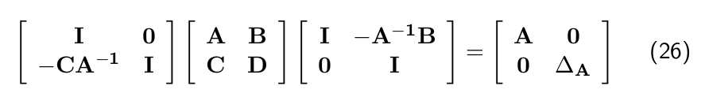
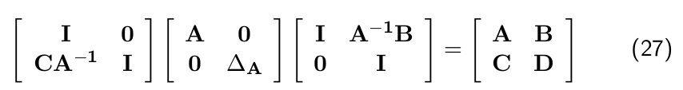
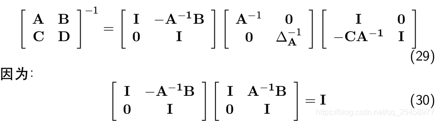

# 舒尔补理论Schur Compliment

在做slam的时候经常遇到的一个概念就是schur complement，了解这个概念，对于理解slam的优化过程也会有很大的帮助；

首先给出的是舒尔补的定义：

舒尔补的由来其实就是将一个矩阵变成对角阵的过程，比如在线性代数课程中会经常用到的Ax=B的求解，如果手动去求解的话就需要将矩阵A|b化简成为上三角矩阵或者下三角矩阵，主要用到的就是高斯消元法。

而舒尔补理论其实就是这个过程的一个总结；

例如，将上述M矩阵变成对角矩阵的过程就是求解舒尔补的过程；

将三个矩阵的联乘展开之后就可以得到DeltaA=D-C A.inv B

通过左乘和右乘，将矩阵M变成一个对角阵。有了deltaA公式，就可以由M矩阵直接求出其对应的对角阵，同理，也就可以从一个对角阵中恢复出M矩阵：

舒尔补的一个好处就是可以很快地求出矩阵M所对应的逆， 由式27可以看出，将一个M矩阵分解成三个矩阵相乘的形式，上三角，对角阵，和下三角矩阵的逆求解是很方便的。因此，矩阵M的逆可以很快地求出：

------

*转载自：*

[舒尔补理论Schur Compliment](https://blog.csdn.net/qq_25458977/article/details/102721773)

