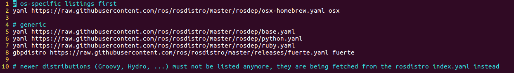
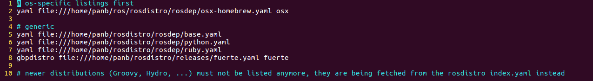

# rosdep update 失败解决办法

## rosdep

不管是安装哪个版本的ros，最后执行的两步都是：

```bash
sudo rosdep init
rosdep update
```

不过，大概率会出现下面的错误：

```bash
ERROR: cannot download default sources list from:
https://raw.githubusercontent.com/ros/rosdistro/master/rosdep/sources.list.d/20-default.list
Website may be down.
```

上面的错误意味着rosdep配置失败。

事实上，在实际使用过程中，即使不执行上面的两步也并不会影响ros开发环境的使用，但如果执着于搭建完整的ros开发环境的话，可以使用后面的方法来解决rosdep错误。

那么这个rosdep有什么用呢？

其实，rosdep是一个用于安装系统依赖项的命令行工具。比如我们创建了一个工作空间，然后创建了ros包，该ros包需要依赖串口包、地图包等等，那么可以手动依次下载依赖包，也可以使用下面的rosdep命令自动下载相关依赖：

```bash
cd /..../xx_ws  #进入要编译的ros workspace
rosdep install --from-paths src --ignore-src -r -y
```

## rosdep update失败解决办法

手动下载、配置，100%成功。

### 1、从github上下载rosdistro文件夹到本地

记好下载到的目录，下面需要用到

```bash
git clone https://github.com/ros/rosdistro
```

### 2、修改20-default.list文件

/home/xxx对应上面rosdistro下载到的目录，后面的步骤指的均是此目录

```bash
sudo vi /home/xxx/rosdistro/rosdep/sources.list.d/20-default.list
```

将文件中的网址https://raw.githubusercontent.com/ros/rosdistro/master修改为下载目录file:///home/xxx/rosdistro

修改前：



修改后：



```bash
# os-specific listings first
yaml file:///home/panb/rosdistro/rosdep/osx-homebrew.yaml osx

# generic
yaml file:///home/panb/rosdistro/rosdep/base.yaml
yaml file:///home/panb/rosdistro/rosdep/python.yaml
yaml file:///home/panb/rosdistro/rosdep/ruby.yaml
gbpdistro file:///home/panb/rosdistro/releases/fuerte.yaml fuerte

# newer distributions (Groovy, Hydro, ...) must not be listed anymore, they are being fetched from the rosdistro index.yaml instead
```


### 3、修改python package中的相关路径

将指向外网raw.githubusercontent.com的文件路径重定向到本地。

主要有两个package：rosdep2和rosdistro
cd进入rosdep2目录：python3为`/usr/lib/python3/dist-packages/rosdep2`，python2为`/usr/lib/python2.7/dist-packages/rosdep2`
执行`grep githubusercontent *`找到三个地方：sources_list.py、rep3.py和gbpdistro_support.py
cd进入rosdistro目录：python3为`/usr/lib/python3/dist-packages/rosdistro`，python2为`/usr/lib/python2.7/dist-packages/rosdistro`
执行`grep githubusercontent *`找到一个地方：\_\_init\_\_.py

注意：不同的ubuntu版本和ros版本，使用的python版本不同，python3和python2的路径并不完全一致。

#### a、修改sources_list.py文件

对于python3：

```
sudo vi /usr/lib/python3/dist-packages/rosdep2/sources_list.py
```

对于python2：

```
sudo vi /usr/lib/python2.7/dist-packages/rosdep2/sources_list.py
```

修改DEFAULT_SOURCES_LIST_URL

```
#DEFAULT_SOURCES_LIST_URL = 'https://raw.githubusercontent.com/ros/rosdistro/master/rosdep/sources.list.d/20-default.list'
DEFAULT_SOURCES_LIST_URL = 'file:///home/xxx/rosdistro/rosdep/sources.list.d/20-default.list'
```

#### b、修改rep3.py文件

对于python3：

```
sudo vi /usr/lib/python3/dist-packages/rosdep2/rep3.py
```

对于python2：

```
sudo vi /usr/lib/python2.7/dist-packages/rosdep2/rep3.py
```

修改REP3_TARGETS_URL

```
#REP3_TARGETS_URL = 'https://raw.githubusercontent.com/ros/rosdistro/master/releases/targets.yaml'
REP3_TARGETS_URL = 'file:///home/xxx/rosdistro/releases/targets.yaml'
```

#### c、修改gbpdistro_support.py文件

对于python3：

```
sudo vi /usr/lib/python3/dist-packages/rosdep2/gbpdistro_support.py
```

对于python2：

```
sudo vi /usr/lib/python2.7/dist-packages/rosdep2/gbpdistro_support.py
```

修改FUERTE_GBPDISTRO_URL

```
#FUERTE_GBPDISTRO_URL = 'https://raw.githubusercontent.com/ros/rosdistro/master/releases/fuerte.yaml'
FUERTE_GBPDISTRO_URL = 'file:///home/panb/rosdistro/releases/fuerte.yaml'
```

#### d、修改\_\_init\_\_.py文件

对于python3：

```
sudo vi /usr/lib/python3/dist-packages/rosdistro/__init__.py
```

对于python2：

```
sudo vi /usr/lib/python2.7/dist-packages/rosdistro/__init__.py
```

修改DEFAULT_INDEX_URL

```
#DEFAULT_INDEX_URL = 'https://raw.githubusercontent.com/ros/rosdistro/master/index-v4.yaml'
DEFAULT_INDEX_URL = 'file:///home/xxx/rosdistro/index-v4.yaml'
```

### 4、执行rosdep update

```
sudo rosdep init
rosdep update
```


*参考网址：*

https://blog.csdn.net/zbw1185/article/details/123807654