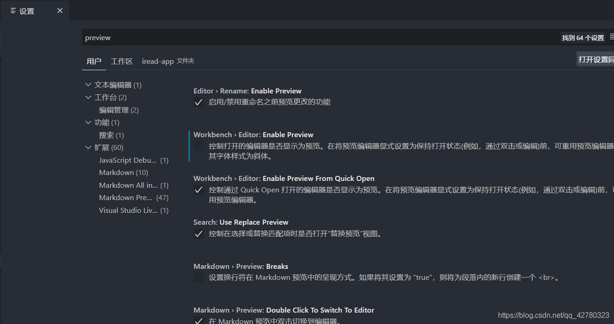

# vscode 打开新文件会覆盖旧文件的解决办法，避免覆盖（简单完美解决）

vscode 打开新文件会覆盖旧文件，很烦人。解决方案：

- 1。每次要打开的文件双击就可以。这样双击打开的文件不会覆盖。单机打开的文件会覆盖，其实也是避免打开的文件编辑窗口太多。

- 2。最佳方法：

在vscode里面设置。 打开编辑器页面：找到     文件----》 首选项---》 设置--》 然后搜索 Enable Preview这个设置选项。

找到Workbench>Editor:Enable Preview这个关闭就可以。是不是很简单。（在下图第二个选项，关闭就可以）

操作如图：

原文链接：

https://blog.csdn.net/qq_42780323/article/details/108275463